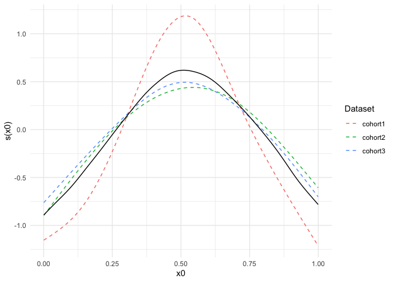
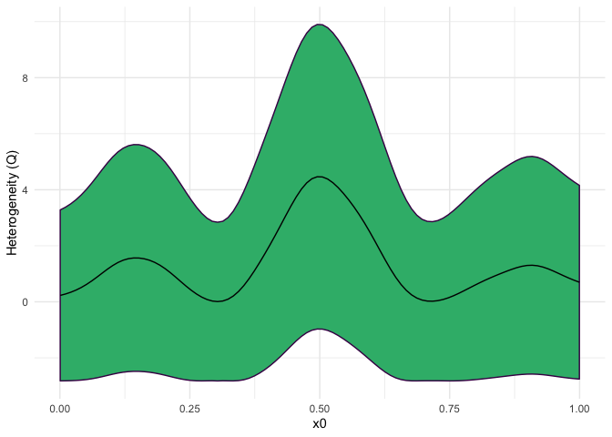
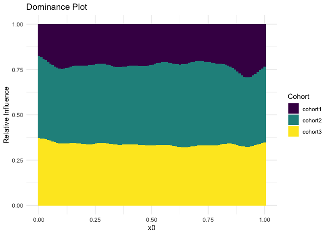

<!-- README.md is generated from README.Rmd. Please edit that file -->

# metagam

<!-- badges: start -->

[](https://travis-ci.org/lifebrain/metagam)
<!-- badges: end -->

## Overview

metagam is an R-package for flexible meta-analysis of generalized
additive models (GAMs). Its main application is cases in which raw data
are located in multiple locations, and cannot be shared due to ethical
or regulatory restrictions. metagam provides functions for removing all
individual participant from from GAMs fitted separately at each
location, such that the resulting object can be shared to a central
location. Next, metagam provides functions for meta-analysing these
fitted GAMs using pointwise meta-analysis, as well as plotting and
summary methods for analyzing the meta-analytic fits.

This package is under development, so changes to the interface can be
expected. Suggestions for improvements and bug reports are warmly
welcome, either by filing an
[Issue](https://github.com/lifebrain/metagam/issues) or opening a [Pull
Request](https://github.com/lifebrain/metagam/pulls).

## Installation

Install the current development version of `metagam` from
[GitHub](https://github.com/) with:

``` r
# install.packages("remotes")
remotes::install_github("lifebrain/metagam")
```

## Application Example

``` r
library(metagam)
```

Assume some data of interest are located in three different cohorts. In
order to increase statistical power and hence be more able to detect
relationships in the data, we would ideally fit a GAM to all three
datasets combined, using a model on the form `y ~ s(x0) + s(x1) +
s(x2)`, where `y` is an outcome of interest and `x1` and `x2` are
explanatory variables. The smooth functions `s()` allow the outcome to
vary nonlinearly as a function of each explanatory variable. When all
three datasets are not available in a single location, we cannot fit a
GAM using this mega-analytic approach. The metagam package provides a
flexible solution to this problem, which here will be illustrated.

We start by simulation three datasets using the `gamSim()` function from
mgcv.

``` r
library(mgcv)
## simulate three datasets
set.seed(123)
datasets <- lapply(1:3, function(x) gamSim(scale = 3, verbose = FALSE))
```

In each data location, we assume a GAM with the generic form
`y~s(x0)+s(x1)+s(x2)` is fit to the data. Notably, model parameters like
knot locations, number of basis functions, and smoothing method does not
need to be identical in each separate fit. Instead, the parameters can
be optimized independently to fit the data in each location.

Here is an example:

``` r
## Data location 1
fit1 <- gam(y ~ s(x0, k = 8, bs = "cr") + s(x1, bs = "cr") + s(x2, bs = "cr"), 
            data = datasets[[1]])

## Data location 2, use P-splines for the first and third term
fit2 <- gam(y ~ s(x0, bs = "ps") + s(x1, k = 20, bs = "cr") + s(x2, bs = "bs"), 
            data = datasets[[2]])

## Data location 3, use maximum likelihood for smoothing
fit3 <- gam(y ~ s(x0, bs = "cr") + s(x1, bs = "cr") + s(x2, bs = "cr"), 
            data = datasets[[3]], method = "ML")
```

The `gam` objects `fit1`, `fit2`, and `fit3` contain individual
participant data in various forms, and hence there are many cases in
which these should not be shared. The function `strip_rawdata()` from
metagam removes all such rawdata. We here illustrate how this function
can be applied at each data location in order to obtain a model fit that
can be shared.

``` r
## Data location 1
fit_no_raw1 <- strip_rawdata(fit1)

## Data location 2
fit_no_raw2 <- strip_rawdata(fit2)

## Data location 3
fit_no_raw3 <- strip_rawdata(fit3)
```

Now assume that the objects `fit_no_raw1`, `fit_no_raw2`, and
`fit_no_raw3` have been gathered in a single location. We can now
perform a meta-analysis of these fits using the `metagam()` function. We
gather them in a list:

``` r
models <- list(cohort1 = fit_no_raw1, 
               cohort2 = fit_no_raw2, 
               cohort3 = fit_no_raw3)
```

It is typically most convenient to analyze a single smooth term at a
time. We start with the term `s(x0)`, and set `grid_size=100` to get 100
equally spaced values of `x0` within the range of values encountered in
the three model fits. The summary method prints out some information as
well as meta-analytic p-values for the term.

``` r
metafit <- metagam(models, grid_size = 100, terms = "s(x0)")
summary(metafit)
#> Meta-analysis of GAMs from 3 cohorts, using method FE.
#> 
#> Smooth terms analyzed: s(x0) 
#> 
#> Meta-analytic p-values of smooth terms:
#> 
#> Test                         s(x0)
#> ----------------------  ----------
#> Stouffer's sum of z      0.0000143
#> Edgington's sum of p     0.0001186
#> Wilkinson's maximum p    0.0002717
#> Wilkinson's minimum p    0.0002545
#> logit p method           0.0000207
#> Fisher's sum of logs     0.0000191
```

The default plotting function shows the fits on the separate datasets
together with the meta-analytic fit.

``` r
plot(metafit)
```



The `plot_heterogeneity()` function visualizes the heterogeneity of the
separate fits as measured by the Q-statistic of Cochrane’s Q test:

``` r
plot_heterogeneity(metafit, axis = "x0", term = "s(x0)")
```



The `plot_domination()` function measures the relative contribution of
each dataset along the x-axis:

``` r
plot_domination(metafit, axis = "x0", term = "s(x0)")
```



The other smooth terms can be analyzed similarly.
