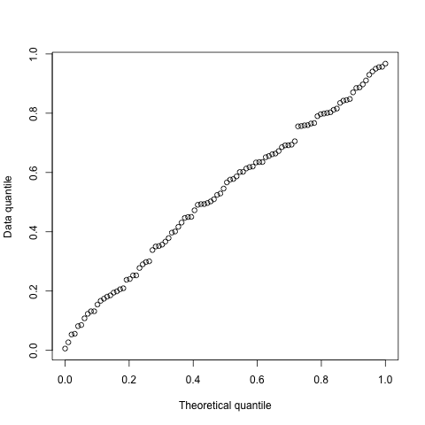

```{r, include = FALSE}
knitr::opts_chunk$set(
  collapse = TRUE,
  comment = "#>"
)
```

```{r setup}
library("metagam")
library("mgcv")
library("metafor")
library("ggplot2")
theme_set(theme_bw())
```

Previous versions of metagam had built-in aggregation of p-values, using the [metap](https://cran.r-project.org/package=metap) package. However, this had two drawbacks:

- metap depends on multtest, which is a Bioconductor package, and this dependency made the installation of metagam unnecessarily complicated.
- Aggregation of p-values might not always make sense for smooth terms. (Thanks to Alexandre Loureiro for discovering this!)

This vignette briefly describes the latter issue, and shows how the metap package can be used directly on output from metagam.

## What can go wrong when combining p-values?

Consider the two datasets below, which have completely opposite effects. I have also included the code for simulating the data.

```{r, echo=FALSE}
simulate_data <- function(){
  dat1 <- data.frame(x = runif(100))
  dat1$y <- dat1$x + rnorm(100, sd = .7)
  
  dat2 <- dat1
  dat2$y <- -dat2$x + .1 * dat2$x^2 + rnorm(100, sd = .7)
  
  list(dat1 = dat1, dat2 = dat2)
}
set.seed(1)
dd <- simulate_data()

ggplot(dd$dat1, aes(x = x, y = y)) + 
  geom_point() + 
  ggtitle("Dataset 1")

ggplot(dd$dat2, aes(x = x, y = y)) + 
  geom_point() + 
  ggtitle("Dataset 2")

```

Fitting a GAM to each dataset separately, we see that the effect is significant at $\alpha = 0.05$ level.

```{r}
mod1 <- gam(y ~ s(x, bs = "cr"), data = dd$dat1)
summary(mod1)

mod2 <- gam(y ~ s(x, bs = "cr"), data = dd$dat2)
summary(mod2)
```

Now let us try a metagam fit.

```{r}
models <- list(strip_rawdata(mod1), strip_rawdata(mod2))
metafit <- metagam(models)
```

Plotting the meta-analytic fit, we see that the 95 % confidence bands completely cover zero.

```{r}
ggplot(metafit$meta_estimates, aes(x = x, y = estimate, ymin = ci.lb, ymax = ci.ub)) + 
  geom_line() + 
  geom_ribbon(alpha = .3) + 
  geom_hline(yintercept = 0, linetype = "dashed")
```

The object returned by `metagam` has a `pvals` element which contains p-values for each term in each individual fit.

```{r}
metafit$pvals
```

Combining the p-values using any of the methods available in metap, we do however see that the effects are signficiant at $\alpha = 0.05$. 

```{r, eval=FALSE}
library("metap")
allmetap(p = metafit$pvals$`p-value`, method = "all")
```

```{r, echo=FALSE}
structure(list(p = list(logitp = 5.61819601706602e-07, maximump = 1.25713383795263e-06, 
    meanp = NA_real_, meanz = 6.75835070011165e-08, minimump = 7.22516917847225e-06, 
    sumlog = 8.23242533258099e-08, sump = 6.32623953067482e-07, 
    sumz = structure(4.8107525303013e-08, .Dim = c(1L, 1L))), 
    valid = list(logitp = 2L, maximump = 2L, meanp = 2L, meanz = 2L, 
        minimump = 2L, sumlog = 2L, sump = 2L, sumz = 2L), eponym = c("", 
    "", "", "", "Tippett", "Fisher", "Edgington", "Stouffer")), row.names = c("logitp", 
"maximump", "meanp", "meanz", "minimump", "sumlog", "sump", "sumz"
), class = c("allmetap", "data.frame"))
```

This happens because combination of p-values is not aware of the direction of the effects. Hence, rather than having this a part of the package, we suggest that users who know what they're doing combine the p-values using metap package.

For comparison, fitting a linear model to each dataset and combining the slopes using `metafor` gives a p-value 0.9296, which makes a lot more sense.

```{r}
mod1 <- lm(y ~ x, data = dd$dat1)
mod2 <- lm(y ~ x, data = dd$dat2)

estimates <- c(coef(mod1)[["x"]], coef(mod2)[["x"]])
sampling_variances <- c(vcov(mod1)[["x", "x"]], vcov(mod2)[["x", "x"]])
rma(estimates, vi = sampling_variances)
```


## A better way to compute p-values?

### Simultaneous confidence intervals

Let's create another GAM fit, this time using the `gamSim` function. The dashed lines in the plot correspond to two standard errors above and below the estimate. However, this is a pointwise confidence interval, which for our practical purposes means that under repeated sampling from the population, it will contain the true function less than 95 % of the times. See, e.g., Chapter 6.5 of @Ruppert2003, @Sorensen2021b or [this blog post](https://fromthebottomoftheheap.net/2016/12/15/simultaneous-interval-revisited/). What we need is a simultaneous confidence interval.

```{r}
set.seed(123)
dat <- gamSim(verbose = FALSE)
mod <- gam(y ~ s(x0, bs = "cr"), data = dat)
plot(mod)
```


We see that the critical value for a 95 % simultaneous interval is above 2.

```{r}
grid <- with(dat, data.frame(x0 = seq(min(x0), max(x0), length = 200)))
masd <- getmasd(mod, grid, 10000, terms = "s(x0)")
(crit <- quantile(masd, prob = .95, type = 8))
```


We can plot the two together, and we see that the simultaneous confidence interval is bigger.

```{r}
fit <- predict(mod, newdata = grid, se.fit = TRUE)
dat <- data.frame(
  x0 = grid$x0,
  pred = fit$fit,
  ci_pt_lb = fit$fit + qnorm(.025) * fit$se.fit,
  ci_pt_ub = fit$fit + qnorm(.975) * fit$se.fit,
  ci_sim_lb = fit$fit - crit * fit$se.fit,
  ci_sim_ub = fit$fit + crit * fit$se.fit
)

ggplot(dat, aes(x = x0, y = pred)) + 
  geom_line() + 
  geom_ribbon(aes(ymin = ci_pt_lb, ymax = ci_pt_ub), alpha = .3) + 
  geom_ribbon(aes(ymin = ci_sim_lb, ymax = ci_sim_ub), alpha = .3)
```


### Combining simultaneous confidence intervals

In the current version of metagam, it is possible to combine simultaneous confidence intervals for each separate fit. The critical value multiplied by the standard errors is then used as the weight when it is meta analytically combined. Significance testing can be done by checking if it is possible to fit a constant function within the simultaneous confidence bands, which is the same as checking whether the maximum of the lower band across the range of x-values is larger than the minimum of the upper band across the range of x-values. We illustrate it here.


```{r}
set.seed(124)
datasets <- lapply(1:5, function(x) gamSim(scale = 5, verbose = FALSE))

models <- lapply(datasets, function(dat){
  model <- gam(y ~ s(x2, bs = "cr"), data = dat)
  strip_rawdata(model)
})

meta_analysis <- metagam(models, terms = "s(x2)", grid_size = 100,
                         nsim = 10000, alpha_seq = .05)
```


Convenience functions will be added later, but for now it is a bit manual. Notice that the outer bands are bigger.

```{r}
sim_conf <- meta_analysis$sim_ci$`0.05`
ptw_conf <- meta_analysis$meta_estimates
ggplot(sim_conf, aes(x = x2)) + 
  geom_line(aes(y = pred)) + 
  geom_ribbon(aes(ymin = ci_sim_lb, ymax = ci_sim_ub), alpha = .3) + 
  geom_ribbon(data = ptw_conf, aes(ymin = ci.lb, ymax = ci.ub), alpha = .3)
```


We can also obtain the p-value:

```{r}
meta_analysis$meta_pval
```


### Does it work?

We shouldn't trust a single example, so here we will show some simulations. We do this by simulating a case where the true relationship is zero, and check if the distribution of p-values is close to uniform?

```{r, eval=FALSE, echo=FALSE}
library(parallel)
cl <- makeCluster(10)
pvals <- parLapply(
  cl = cl, X = 1:100, fun = function(x){
    models <- lapply(1:5, function(i){
      dat <- data.frame(x = runif(100), y = rnorm(100))
      mod <- mgcv::gam(y ~ s(x, bs = "cr"), data = dat)
      metagam::strip_rawdata(mod)
      })
    metagam::metagam(models, nsim = 1000, alpha_seq = .05)$meta_pval
  }
)
stopCluster(cl)
png("figures/quantile_plot.png")
plot(qunif(seq(from = 0, to = 1, length.out = 100)), 
     sort(as.numeric(unlist(pvals))),
     xlab = "Theoretical quantile",
     ylab = "Data quantile")
dev.off()
```


```{r, eval=FALSE}
library(parallel)
cl <- makeCluster(10)
pvals <- parLapply(
  cl = cl, X = 1:100, fun = function(x){
    models <- lapply(1:5, function(i){
      dat <- data.frame(x = runif(100), y = rnorm(100))
      mod <- mgcv::gam(y ~ s(x, bs = "cr"), data = dat)
      metagam::strip_rawdata(mod)
      })
    metagam::metagam(models, nsim = 1000, alpha_seq = .05)$meta_pval
  }
)
stopCluster(cl)

plot(qunif(seq(from = 0, to = 1, length.out = 100)), 
     sort(as.numeric(unlist(pvals))),
     xlab = "Theoretical quantile",
     ylab = "Data quantile")
```



The quantile plot above looks sufficiently satisfactory to include this in the package. We will conduct much more extensive simulation studies in a future paper.

# References


